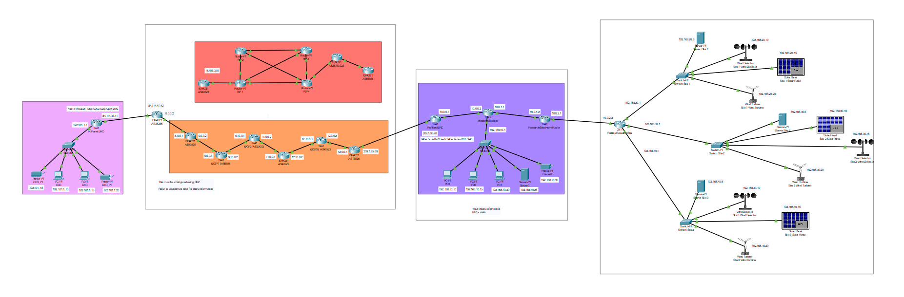
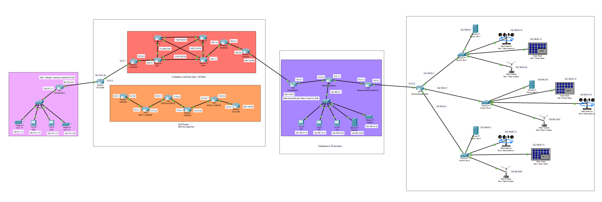

# NoPlanetB Network Migration Project

This repository contains all the Cisco Packet Tracer files and accompanying documentation for the “NoPlanetB Network Routing Management” coursework. The goal of this project was to migrate NoPlanetB’s existing network (Head Office, Research Centre, Monitoring Station, and three remote Research Sites) into a new topology, using a mix of Static Routing, RIP, and BGP (Green/Orange/Red scenarios).

---

## 📁 Repository Structure

```bash
Cisco-Network-Routing/
├── pkt/
│   ├── Final-Config-ORANGE_ROUTE.pkt        # Four-route BGP setup
│   ├── Final-Config-ORANGE_ROUTE.pkt        # Full three-route BGP + RIP-mesh
├
├── Assets/                                  # Logical Topology Diagrams
└── Docs/                                    # Documentations
```

---

## 📄 Requirements

See [REQUIREMENTS.md](./Docs/Requirements.md) for a detailed breakdown of:

- Project overview & scope  
- Topology & IP addressing  
- Routing protocol options (Static, RIP, BGP scenarios)  
- Security/legal configuration  

---


## 🛠 Prerequisites

- **Cisco Packet Tracer**  

---

## 🚀 How to Open & Validate

1. **Open Packet Tracer:**  
   Launch Cisco Packet Tracer on your machine.

2. **Load a Scenario:**  
   File → Open → select one of the `.pkt` files in the `pkt/` folder.

3. **Inspect Topology & Config:**  
   - Verify interface IPs, subnet masks, and default gateways under each router’s CLI.  
   - Check BGP neighbour relationships and route advertisements (`show ip bgp summary`, `show ip route bgp`).  
   - In the Red scenario, confirm RIP mesh convergence (`show ip rip database`, `show ip route rip`).

4. **Test Connectivity:**  
   - From Head Office router, ping and traceroute to the Research Centre router and sample end-hosts.  
   - Reverse: from Research Centre back to Head Office and across each research site.


---

## 🔍 Project Highlights

- **IP Addressing**  
  - /30 subnets for point-to-point WAN links  
  - /24 LAN subnets for each site, leaving room for future expansion  

- **Routing Protocols**  
  - Static routes at network boundaries  
  - RIP mesh (iBGP simulation) for internal backbone in Red scenario  
  - BGP peering between simulated ASes for external connectivity  

- **Security & Legality**  
  - MOTD/login banners and console/vty passwords per AS classification  

---

## Logical Topology Diagrams

<table>
  <tr>
    <td align="center"><strong>Orange Scenario</strong></td>
    <td align="center"><strong>Red Scenario</strong></td>
  </tr>
  <tr>
    <td align="center">
      
    </td>
    <td align="center">
      
    </td>
  </tr>
</table>


---

## Developer Info

<table align="center">
  <tr>
    <td align="center">
      <a href="https://github.com/nirmalphilips">
        <br/>
        <sub><b>Nirmal Philips Tom</b></sub>
      </a>
      <br/><i>nirmalphilips@outlook.com</i>
      </tr>
</table>


---

## ⚠️ Disclaimer

**This project has been developed as part of the Module Assesment (Network Routing Management) Coursework for the programme _Computer Engineering BEng (Hons)_ (Academic Year 2024/25) at the University of Greenwich.**

**All credits must be given to the creators and the University of Greenwich.**

---